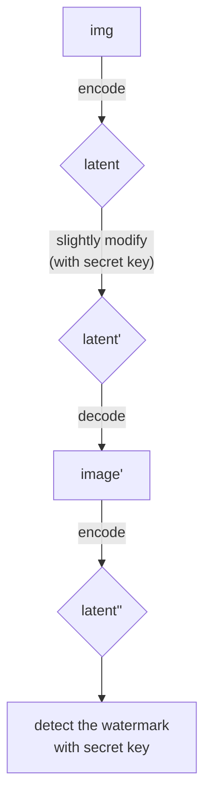
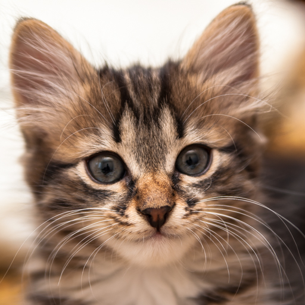
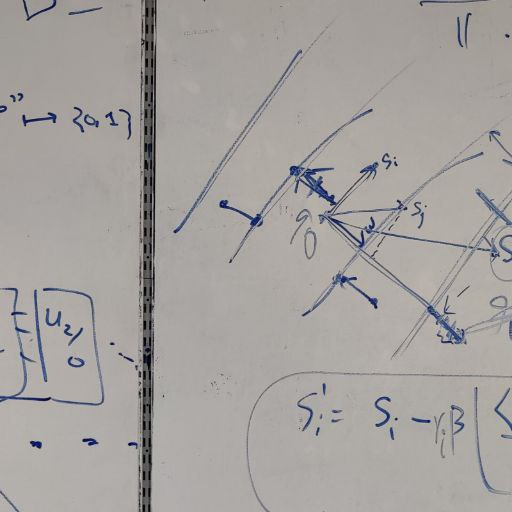
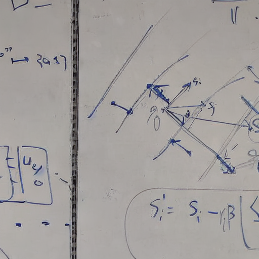

# Watermarking Latent Representations via CLWE

*AI for Cybersecurity, and Security for AI*

This project is a proof of concept for watermarking arbitrary input images using their latent representations. The security of the watermarking scheme is based on the security of worst case lattice problems, particularly through the  Continuous Learning With Errors problem.
We believe that this simple strategy of watermarking latent representaions should extend to video and audio content, paving way to new applications in content provenance, anti-piracy, and securing AI-generated media. This approach could also be adapted for use in digital rights management (DRM) systems, ensuring the authenticity and ownership of multimedia content.

This project was built for a TikTok hackathon under the theme **AI x Cybersecurity: use AI for cybersecurity, use cybersecurity for AI**. Our solution leverages the security of lattice-based cryptography (LWE) and the power of AI models to watermark arbitrary input images, not just generated ones. Among other applications, this enables platforms like TikTok to verify content authenticity and prevent reward payouts for stolen or reposted content, addressing both AI for security and security for AI.

Authors:

1. [Aditya Morolia](https://thecharmingsociopath.github.io)
2. Yaonan Zhang

This project is inspired by a recent work of [Shehata et. al.](https://arxiv.org/abs/2411.11434)

## Table of Contents

- [Problem Statement](#problem-statement)
- [Features & Functionality](#features--functionality)
- [Applications](#applications)
- [Technical Overview](#technical-overview)
  - [Glossary of Terms](#glossary-of-terms)
  - [Development Tools](#development-tools)
  - [APIs & Assets](#apis--assets)
  - [Libraries Used](#libraries-used)
  - [Watermarking Process](#watermarking-process)
  - [Testing for the presense of the watermark, given the secret key](#testing-for-the-presense-of-the-watermark-given-the-secret-key)
- [Usage](#usage)
- [Example Results](#example-results)
- [Future Work](#future-work)
- [References](#references)

---

## Problem Statement

**How can we use AI to enhance cybersecurity, or how can cybersecurity principles strengthen AI?**

Our solution: why not both?

- **AI for Security:** Use AI models to embed robust, cryptographically secure watermarks into images, enabling content provenance and anti-piracy measures.
- **Security for AI:** Rely on the hardness of the Continuous Learning With Errors (CLWE) problem, a worst-case lattice problem, to ensure watermark security and resistance to removal or forgery.

Additionally, our approach can be adapted for use in digital rights management (DRM) systems, ensuring the authenticity and ownership of multimedia content. Particularly, it can be used to check the provenance of content uploaded to platforms like TikTok, preventing fraudulent reward payouts for stolen or reposted content.

---

## Features & Functionality

- **Watermarking Arbitrary Images:**  
  Any input image is encoded into a latent space using a pre-trained Variational Auto-Encoder (VAE) (from Stable Diffusion). Given a secret key, a CLWE (Continuous Learning With Errors) based *watermark* is injected into the latent representation.
- **Watermark Detection:**  
  Given the secret key, the watermark can be statistically detected using the Rayleigh test, which measures the presence of a secret direction in the latent space.
- **Content Provenance:**  
  Platforms can verify if content is original a user, a model or an organization, enabling preventing fraudulent reward payouts for stolen content, reposts, or forgeries.
- **Security Guarantees:**  
  The watermark's security is based on the hardness of lattice problems, making it resistant to adversarial detection.
- **Robustness to Transformations:**  
  The watermark is designed to be robust against common image transformations such as resizing, cropping, and compression.
- **Performance:** Our implementation is efficient, leveraging pre-trained models and optimized libraries for fast processing. Particularly, watermark injection works in under 30 seconds for a 512x512 image on a standard laptop CPU.
- **Ease of Integration:**  
  The watermarking process can be integrated into existing AI pipelines, such as image generation or editing workflows.
- **Open Source:**  
  The project is open source, allowing for community contributions and further research.

---

## Applications

- **Content Provenance:**  
  Platforms like TikTok can verify the originality of uploaded images and prevent reward payouts for stolen content. They can also use this to track the source of images and ensure proper attribution.
- **Anti-Piracy:**  
  Robust watermarking makes it difficult for adversaries to remove or forge watermarks. With more compute and specialized post-training, our method should easily extend to video and audio content, helping combat piracy across various media types.
- **AI Model Security:**  
  Demonstrates how cryptographic principles can be used to secure AI-generated and AI-processed content.
- **Forensics, Law and Digital Rights Management (DRM):**  
  Ensures the authenticity and ownership of multimedia content, protecting intellectual property rights. Watermarked images can serve as evidence in legal disputes, proving the origin and authenticity of digital content.

## Technical Overview



### Glossary of Terms

- **VAE (Variational Auto-Encoder):** A type of neural network that encodes input data into a latent space and decodes it back to the original space.
- **CLWE (Continuous Learning With Errors):** A cryptographic problem based on the worst case hardness of lattice problems, used here to base the security of the embed watermarks upon.
- **Rayleigh Test:** A statistical test used to detect non-uniformity in circular data, applied here to detect the presence of the watermark in latent vectors.
- **Latent Space:** A lower-dimensional representation of data learned by models like VAEs, capturing essential features.
- **HuggingFace Diffusers:** A library for working with machine learning models, including pre-trained VAEs that we use here.
- **Diffusion Models:** Generative models that iteratively refine random noise into coherent data, such as images.
- **Stable Diffusion:** A popular diffusion model for generating high-quality images from text prompts.

### Development Tools

- **Programming Language:** Python 3.10+
- **Platform:** macOS, Linux

### APIs & Assets

- **Pre-trained Model:**  
  [Stable Diffusion VAE](https://huggingface.co/CompVis/stable-diffusion-v1-4) via HuggingFace Diffusers API
- **Image Assets:**  
  Any PNG/JPG image; sample images provided in the `images/` folder

### Libraries Used

- [`diffusers`](https://github.com/huggingface/diffusers) (for VAE encoding/decoding)
- [`torch`](https://pytorch.org/) (PyTorch, for tensor operations)
- [`torchvision`](https://pytorch.org/vision/stable/index.html) (image utilities)
- [`transformers`](https://github.com/huggingface/transformers) (model loading)
- [`matplotlib`](https://matplotlib.org/) (visualization)
- [`scipy`](https://scipy.org/) (statistics, Rayleigh test)
- [`numpy`](https://numpy.org/) (numerical operations)
- [`Pillow`](https://python-pillow.org/) (image manipulation)

### Watermarking Process

1. **Encoding:**  
   The input image is resized and encoded into a latent representation using the variational auto-encoder (VAE).
2. **Watermark Injection:**  
   A secret direction (unit vector) is sampled using a Gaussian distribution. The latent vector is divided into various blocks, and each block is modified by projecting it orthogonally to the secret direction, adding small Gaussian noise to simulate the CLWE distribution. Each block is a *sample* from the CLWE distribution parameterized by the secret direction.
3. **Decoding:**  
   The watermarked latent is decoded back into an image, using the inverse of the previous step.
4. **Detection:**  
   The Rayleigh test is applied to the projected errors in the latent space to statistically detect the watermark.

### Testing for the presense of the watermark, given the secret key

The Rayleigh test is a statistical method used to detect non-uniformity in circular data (angles). We use it to measure the detectability of the watermark signal embedded in latent vectors.

- **Null hypothesis ($H_0$):** The data is uniformly distributed (no preferred direction).
- **Alternative hypothesis ($H_1$):** The data shows a preferred direction (watermark present).

**How to Compute the Rayleigh score.**

1. **Compute the resultant vector length $R$** from the sum of unit vectors for each angle.
2. **Calculate the test statistic:**  
   $z = R^2 / n$  
   where $n$ is the number of samples.
3. **Compute the $p$-value:**  
   $p = exp(-z)$
   A small $p$-value (e.g., $< 0.05$) indicates the presence of a preferred direction (watermark detected).

**In This Project**,

- The Rayleigh score quantifies how much the watermark signal stands out from noise.
- A higher score (and lower $p$-value) means the watermark is more detectable.
- The test is used to evaluate the effectiveness of watermark injection and recovery.

## Usage

1. Install dependencies: `pip install -r requirements.txt`
2. Run the main script: `python main.py path_to_image.png`

If no image is provided, a blank 512x512 image is used.

## Example Results

- A cute cat

  
  

  ```
  Score - original latent: 0.8407634515610969
  Score - watermarked latent: 2047.915515914207
  Score - recovered latent: 277.40393013277276
  ```

- Some random text on white board

  
  
  
  ```
  Score - original latent: 0.5190702115711778
  Score - watermarked latent: 2047.922844034305
  Score - recovered latent: 287.4833341125703
  ```

- An AI-generated AI painter

  
  

  ```
  Score - original latent: 0.21480081461289857
  Score - watermarked latent: 2047.9199220895846
  Score - recovered latent: 112.39022243191638
  ```

## Future Work

- Extend watermarking to video and audio content.
- Improve robustness against adversarial attacks and image transformations.
- Integrate with existing content management systems at organizations like TikTok for automated provenance checks.

## References

- [CLUE-MARK: Watermarking Diffusion Models using CLWE](https://arxiv.org/abs/2411.11434)
- [Stable Diffusion VAE](https://huggingface.co/CompVis/stable-diffusion-v1-4)
